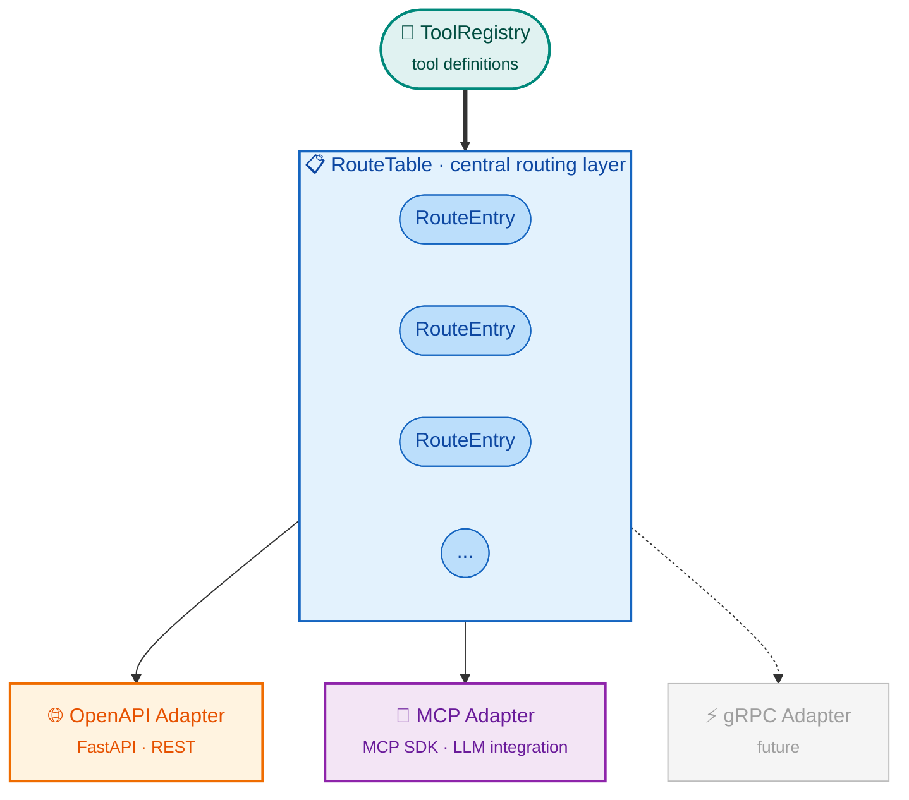

# ToolRegistry Server

[](https://badge.fury.io/py/toolregistry-server)
[](https://pypi.org/project/toolregistry-server/)
[](https://opensource.org/licenses/MIT)

**Server library for [ToolRegistry](https://toolregistry.readthedocs.io/)** - providing OpenAPI and MCP protocol adapters for exposing tools as services.

## Overview

`toolregistry-server` is the server component of the ToolRegistry ecosystem. It bridges tool definitions with HTTP APIs and LLM-compatible protocols, enabling centralized tool management across different communication channels.

## Ecosystem

The ToolRegistry ecosystem consists of three packages:

| Package | Description |
|---------|-------------|
| [`toolregistry`](https://toolregistry.readthedocs.io/) | Core library - Tool model, ToolRegistry, client integration |
| [`toolregistry-server`](https://toolregistry-server.readthedocs.io/) | Server library - Route table, protocol adapters |
| [`toolregistry-hub`](https://toolregistry-hub.readthedocs.io/) | Tool collection - Built-in tools, default server configuration |

```
toolregistry (core)
       ↓
toolregistry-server (server library)
       ↓
toolregistry-hub (tool collection + server config)
```

## Quick Start

```bash
pip install toolregistry-server[all]
```

```python
from toolregistry import ToolRegistry
from toolregistry_server import RouteTable
from toolregistry_server.openapi import create_openapi_app

# Create a registry and register tools
registry = ToolRegistry()

@registry.register
def greet(name: str) -> str:
    """Greet someone by name."""
    return f"Hello, {name}!"

# Create route table and FastAPI app
route_table = RouteTable(registry)
app = create_openapi_app(route_table)
```

[Installation Guide →](usage/installation.md) | [Quick Start →](usage/quickstart.md)

## Key Features

- **Central Route Table**: A unified routing layer that bridges `ToolRegistry` and protocol adapters
- **OpenAPI Adapter**: Expose tools as RESTful HTTP endpoints with automatic OpenAPI schema generation
- **MCP Adapter**: Expose tools via the [Model Context Protocol](https://modelcontextprotocol.io/) for LLM integration
- **Authentication**: Built-in Bearer token authentication support
- **CLI**: Command-line interface for running servers without custom code
- **Dynamic Enable/Disable**: Runtime tool state management without server restart
- **ETag Caching**: HTTP caching via ETag headers for efficient API responses

## Architecture



## Documentation Contents

- [**Installation Guide**](usage/installation.md) - Install `toolregistry-server` with optional extras
- [**Quick Start**](usage/quickstart.md) - Get up and running in minutes
- [**Configuration**](usage/configuration.md) - JSON/JSONC configuration for the CLI
- [**Authentication**](usage/authentication.md) - Bearer token authentication setup
- [**Adapters**](adapters/) - OpenAPI and MCP protocol adapters
- [**CLI Reference**](cli/) - Command-line interface usage
- [**API Reference**](api/) - Comprehensive API documentation

## License

ToolRegistry Server is licensed under the **MIT License**.
