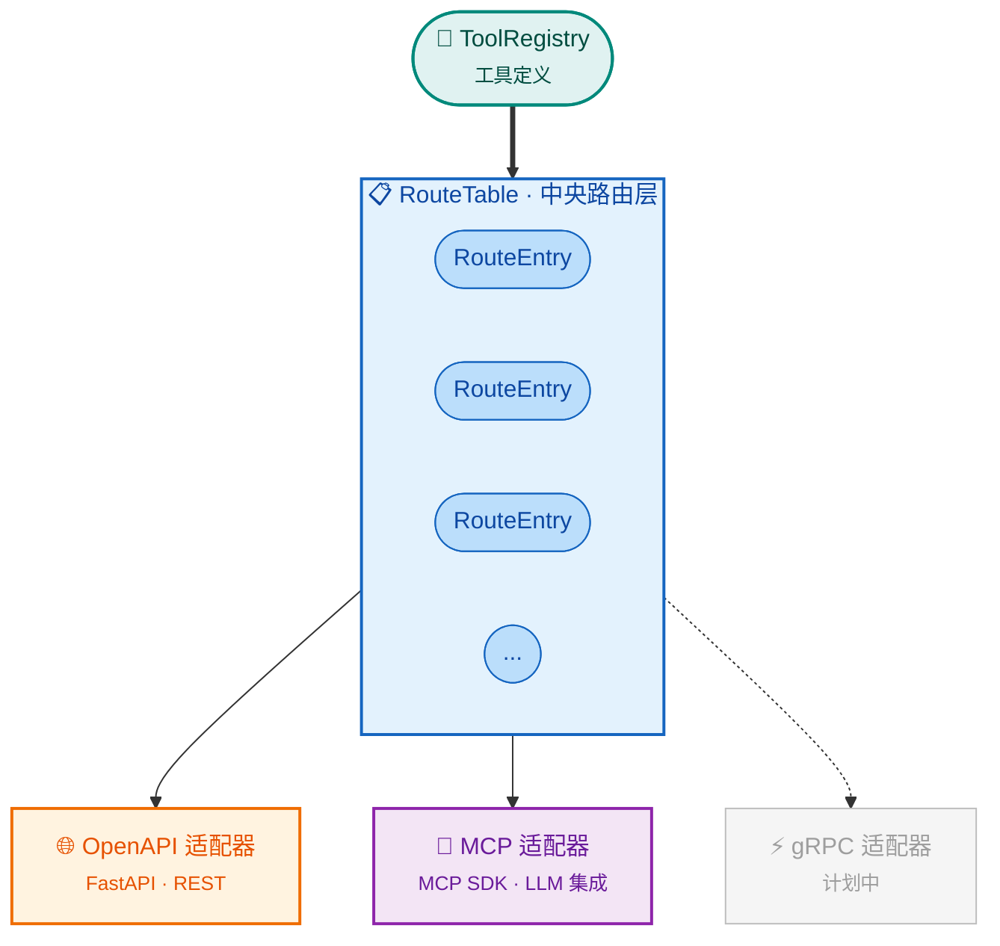

# ToolRegistry Server

[](https://badge.fury.io/py/toolregistry-server)
[](https://pypi.org/project/toolregistry-server/)
[](https://opensource.org/licenses/MIT)

**[ToolRegistry](https://toolregistry.readthedocs.io/) 的服务器库** - 提供 OpenAPI 和 MCP 协议适配器，将工具暴露为服务。

## 概述

`toolregistry-server` 是 ToolRegistry 生态系统的服务器组件。它将工具定义与 HTTP API 和 LLM 兼容协议桥接，实现跨不同通信通道的集中式工具管理。

## 生态系统

ToolRegistry 生态系统由三个包组成：

| 包 | 描述 |
|---|------|
| [`toolregistry`](https://toolregistry.readthedocs.io/) | 核心库 - 工具模型、ToolRegistry、客户端集成 |
| [`toolregistry-server`](https://toolregistry-server.readthedocs.io/) | 服务器库 - 路由表、协议适配器 |
| [`toolregistry-hub`](https://toolregistry-hub.readthedocs.io/) | 工具集合 - 内置工具、默认服务器配置 |

```
toolregistry (核心)
       ↓
toolregistry-server (服务器库)
       ↓
toolregistry-hub (工具集合 + 服务器配置)
```

## 快速开始

```bash
pip install toolregistry-server[all]
```

```python
from toolregistry import ToolRegistry
from toolregistry_server import RouteTable
from toolregistry_server.openapi import create_openapi_app

# 创建注册表并注册工具
registry = ToolRegistry()

@registry.register
def greet(name: str) -> str:
    """按名称问候某人。"""
    return f"Hello, {name}!"

# 创建路由表和 FastAPI 应用
route_table = RouteTable(registry)
app = create_openapi_app(route_table)
```

[安装指南 →](usage/installation.md) | [快速开始 →](usage/quickstart.md)

## 主要特性

- **中央路由表**：统一的路由层，桥接 `ToolRegistry` 和协议适配器
- **OpenAPI 适配器**：将工具暴露为 RESTful HTTP 端点，自动生成 OpenAPI 模式
- **MCP 适配器**：通过 [模型上下文协议](https://modelcontextprotocol.io/) 暴露工具，用于 LLM 集成
- **认证**：内置 Bearer 令牌认证支持
- **命令行工具**：无需编写代码即可运行服务器
- **动态启用/禁用**：运行时工具状态管理，无需重启服务器
- **ETag 缓存**：通过 ETag 头实现 HTTP 缓存，提高 API 响应效率

## 架构



## 文档内容

- [**安装指南**](usage/installation.md) - 安装 `toolregistry-server` 及可选扩展
- [**快速开始**](usage/quickstart.md) - 几分钟内启动并运行
- [**配置**](usage/configuration.md) - CLI 的 JSON/JSONC 配置
- [**认证**](usage/authentication.md) - Bearer 令牌认证设置
- [**适配器**](adapters/) - OpenAPI 和 MCP 协议适配器
- [**命令行工具参考**](cli/) - 命令行接口使用
- [**API 参考**](api/) - 完整的 API 文档

## 许可证

ToolRegistry Server 使用 **MIT 许可证**。
