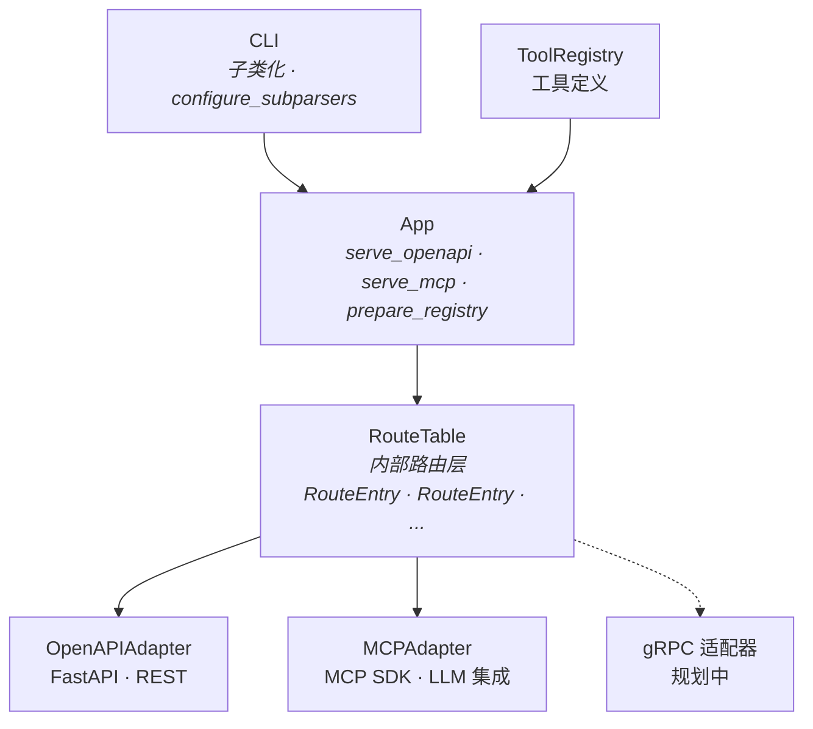

<section class="tr-hero" markdown>
<p class="tr-kicker">将注册表作为 API 服务</p>

# 一个应用，多种协议。

<p class="tr-hero__desc">将标准化的 ToolRegistry 暴露为多种 API 端点，并围绕可组合的 App 编排层提供认证、配置与部署基础能力。</p>

<p class="tr-badges">
  <a href="https://pypi.org/project/toolregistry-server/"></a>
  <a href="https://github.com/Oaklight/toolregistry-server/actions"></a>
  <a href="https://opensource.org/licenses/MIT"></a>
</p>

<div class="tr-actions" markdown>
[快速开始](get-started/quickstart.md){ .tr-button .tr-button--primary }
[OpenAPI 指南](guides/openapi.md){ .tr-button .tr-button--secondary }
[MCP 指南](guides/mcp.md){ .tr-button .tr-button--secondary }
</div>
</section>

## toolregistry-server 是什么？

`toolregistry-server` 是 [ToolRegistry 生态系统](ecosystem.md)中的**服务层**。它将包含 Python 函数的 `ToolRegistry` 暴露为网络服务——通过 OpenAPI 提供 REST API，或通过 Model Context Protocol (MCP) 提供 LLM 工具接口。

```
toolregistry（核心）          → 定义和管理工具
toolregistry-server（本项目） → 通过 OpenAPI 和 MCP 提供工具服务
toolregistry-hub（扩展）      → 精选的即用型工具集合
```

## 快速开始

```bash
pip install toolregistry-server[all]
```

```python
from toolregistry import ToolRegistry
from toolregistry_server import App

registry = ToolRegistry()

@registry.register
def greet(name: str) -> str:
    """按名字问候某人。"""
    return f"Hello, {name}!"

App(registry=registry).serve_openapi(host="0.0.0.0", port=8000)
```

[安装 →](get-started/installation.md) · [快速开始 →](get-started/quickstart.md) · [示例 →](examples/)

## 核心特性

- **App 编排层** — 规范的入口点，将 `ToolRegistry` → `RouteTable` → 适配器串联在一个可组合对象中；可重写 `prepare_registry()` 以使用自定义注册表
- **OpenAPI 适配器** — 自动生成 schema 的 RESTful HTTP 端点
- **MCP 适配器** — 用于 LLM 集成的 [Model Context Protocol](https://modelcontextprotocol.io/)
- **可扩展 CLI** — 子类化 `CLI` 并重写 `configure_subparsers()` 以添加标志；使用 `ServerIdentity` 自定义品牌标识
- **认证** — 通过 `auth.load_tokens()` 内置 Bearer 令牌支持
- **路由表** — 连接注册表和适配器的内部路由层（`RouteEntry` 对象）
- **动态启用/禁用** — 运行时切换工具状态，无需重启
- **ETag 缓存** — 通过 ETag 头实现高效 HTTP 缓存

## 架构


```mermaid
graph TD
    CLI[CLI<br/><i>子类化 · configure_subparsers</i>]
    APP[App<br/><i>serve_openapi · serve_mcp · prepare_registry</i>]
    RT[RouteTable<br/><i>内部路由层<br/>RouteEntry · RouteEntry · ...</i>]
    OA[OpenAPIAdapter<br/>FastAPI · REST]
    MA[MCPAdapter<br/>MCP SDK · LLM 集成]
    GA[gRPC 适配器<br/>规划中]
    TR[ToolRegistry<br/>工具定义]

    CLI --> APP
    TR --> APP
    APP --> RT
    RT --> OA
    RT --> MA
    RT -.-> GA
```

## 许可证

ToolRegistry Server 使用 **MIT 许可证**。
