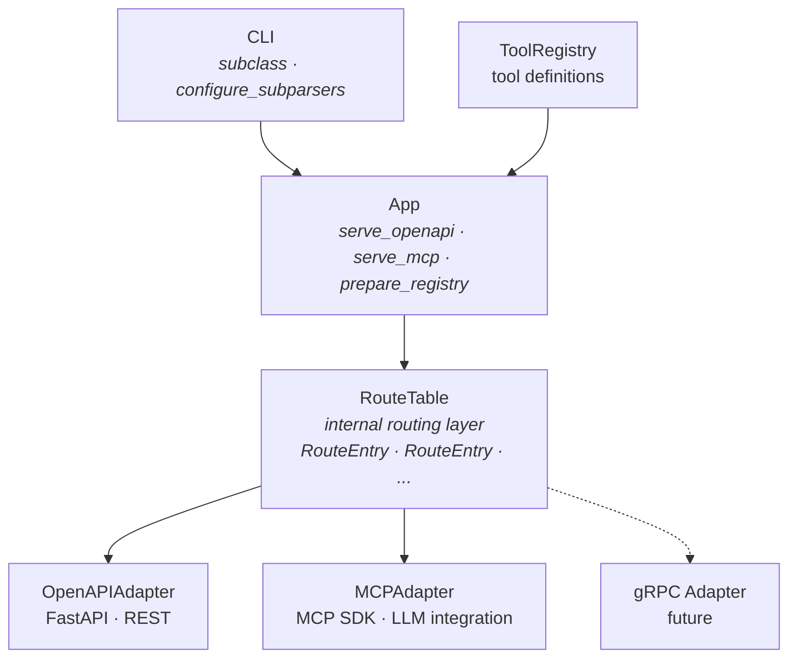

<section class="tr-hero" markdown>
<p class="tr-kicker">Serve registries as APIs</p>

# One app, multiple protocols.

<p class="tr-hero__desc">Expose a normalized ToolRegistry as multiple API endpoints, with authentication, configuration, and deployment primitives built around a composable App orchestration layer.</p>

<p class="tr-badges">
  <a href="https://pypi.org/project/toolregistry-server/"></a>
  <a href="https://github.com/Oaklight/toolregistry-server/actions"></a>
  <a href="https://opensource.org/licenses/MIT"></a>
</p>

<div class="tr-actions" markdown>
[Get Started](get-started/quickstart.md){ .tr-button .tr-button--primary }
[OpenAPI Guide](guides/openapi.md){ .tr-button .tr-button--secondary }
[MCP Guide](guides/mcp.md){ .tr-button .tr-button--secondary }
</div>
</section>

## Pick Your Path

<div class="grid cards" markdown>

-   :material-api:{ .lg .middle } **OpenAPI Adapter**

    ---

    Serve tools as RESTful HTTP endpoints with automatic schema generation.

    [:octicons-arrow-right-24: OpenAPI Guide](guides/openapi.md)

-   :material-robot:{ .lg .middle } **MCP Adapter**

    ---

    Expose tools via the Model Context Protocol for LLM integration.

    [:octicons-arrow-right-24: MCP Guide](guides/mcp.md)

-   :material-cog:{ .lg .middle } **Configuration**

    ---

    Authentication, routing, and runtime options for production deployments.

    [:octicons-arrow-right-24: Configuration](guides/configuration.md)

-   :material-puzzle-edit:{ .lg .middle } **Extend & Customize**

    ---

    Subclass `App` and `CLI` to build your own branded tool server.

    [:octicons-arrow-right-24: Extending](guides/extending.md)

</div>

## Quick Start

```bash
pip install toolregistry-server[all]
```

```python
from toolregistry import ToolRegistry
from toolregistry_server import App

registry = ToolRegistry()

@registry.register
def greet(name: str) -> str:
    """Greet someone by name."""
    return f"Hello, {name}!"

App(registry=registry).serve_openapi(host="0.0.0.0", port=8000)
```

[Installation →](get-started/installation.md) · [Quick Start →](get-started/quickstart.md) · [Examples →](examples/)

## Key Features

- **App orchestration layer** — canonical entry point that wires `ToolRegistry` → `RouteTable` → adapters in a single composable object; override `prepare_registry()` for custom registries
- **OpenAPI Adapter** — RESTful HTTP endpoints with automatic schema generation
- **MCP Adapter** — [Model Context Protocol](https://modelcontextprotocol.io/) for LLM integration
- **Extensible CLI** — subclass `CLI` and override `configure_subparsers()` to add flags; use `ServerIdentity` for custom branding
- **Authentication** — built-in Bearer token support via `auth.load_tokens()`
- **Route Table** — internal routing layer (`RouteEntry` objects) bridging registry and adapters
- **Dynamic Enable/Disable** — toggle tools at runtime without restart
- **ETag Caching** — efficient HTTP caching via ETag headers

## Architecture


```mermaid
graph TD
    CLI[CLI<br/><i>subclass · configure_subparsers</i>]
    APP[App<br/><i>serve_openapi · serve_mcp · prepare_registry</i>]
    RT[RouteTable<br/><i>internal routing layer<br/>RouteEntry · RouteEntry · ...</i>]
    OA[OpenAPIAdapter<br/>FastAPI · REST]
    MA[MCPAdapter<br/>MCP SDK · LLM integration]
    GA[gRPC Adapter<br/>future]
    TR[ToolRegistry<br/>tool definitions]

    CLI --> APP
    TR --> APP
    APP --> RT
    RT --> OA
    RT --> MA
    RT -.-> GA
```

## License

ToolRegistry Server is licensed under the **MIT License**.
