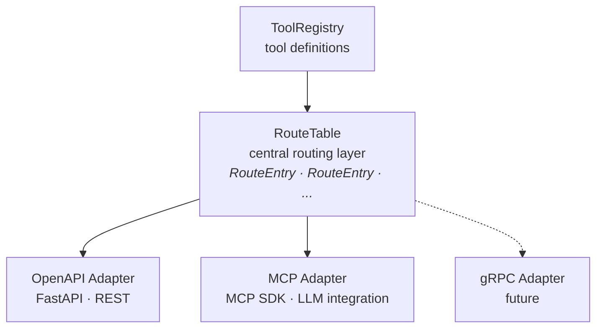

<section class="tr-hero" markdown>
<p class="tr-kicker">Serve registries as APIs</p>

# One route table, multiple protocols.

<p class="tr-hero__desc">Expose a normalized ToolRegistry as multiple API endpoints, with authentication, configuration, and deployment primitives built around a central RouteTable.</p>

<p class="tr-badges">
  <a href="https://pypi.org/project/toolregistry-server/"></a>
  <a href="https://github.com/Oaklight/toolregistry-server/actions"></a>
  <a href="https://opensource.org/licenses/MIT"></a>
</p>

<div class="tr-actions" markdown>
[Get Started](get-started/quickstart.md){ .tr-button .tr-button--primary }
[OpenAPI Guide](guides/openapi.md){ .tr-button .tr-button--secondary }
[MCP Guide](guides/mcp.md){ .tr-button .tr-button--secondary }
</div>
</section>

## What is toolregistry-server?

`toolregistry-server` is the **serving layer** in the [ToolRegistry ecosystem](ecosystem.md). It takes a `ToolRegistry` full of Python functions and exposes them as network services — REST APIs via OpenAPI, or LLM tool interfaces via the Model Context Protocol (MCP).

```
toolregistry (core)         → define & manage tools
toolregistry-server (this)  → serve tools over OpenAPI & MCP
toolregistry-hub (extras)   → curated, ready-to-use tools
```

## Quick Start

```bash
pip install toolregistry-server[all]
```

```python
from toolregistry import ToolRegistry
from toolregistry_server import RouteTable
from toolregistry_server.openapi import create_openapi_app

registry = ToolRegistry()

@registry.register
def greet(name: str) -> str:
    """Greet someone by name."""
    return f"Hello, {name}!"

route_table = RouteTable(registry)
app = create_openapi_app(route_table)
```

[Installation →](get-started/installation.md) · [Quick Start →](get-started/quickstart.md) · [Examples →](examples/)

## Key Features

- **Central Route Table** — unified routing layer bridging `ToolRegistry` and protocol adapters
- **OpenAPI Adapter** — RESTful HTTP endpoints with automatic schema generation
- **MCP Adapter** — [Model Context Protocol](https://modelcontextprotocol.io/) for LLM integration
- **Authentication** — built-in Bearer token support
- **CLI** — run servers from config files without writing code
- **Dynamic Enable/Disable** — toggle tools at runtime without restart
- **ETag Caching** — efficient HTTP caching via ETag headers

## Architecture


```mermaid
graph TD
    TR[ToolRegistry<br/>tool definitions]
    RT[RouteTable<br/>central routing layer<br/><i>RouteEntry · RouteEntry · ...</i>]
    OA[OpenAPI Adapter<br/>FastAPI · REST]
    MA[MCP Adapter<br/>MCP SDK · LLM integration]
    GA[gRPC Adapter<br/>future]

    TR --> RT
    RT --> OA
    RT --> MA
    RT -.-> GA
```

## License

ToolRegistry Server is licensed under the **MIT License**.
